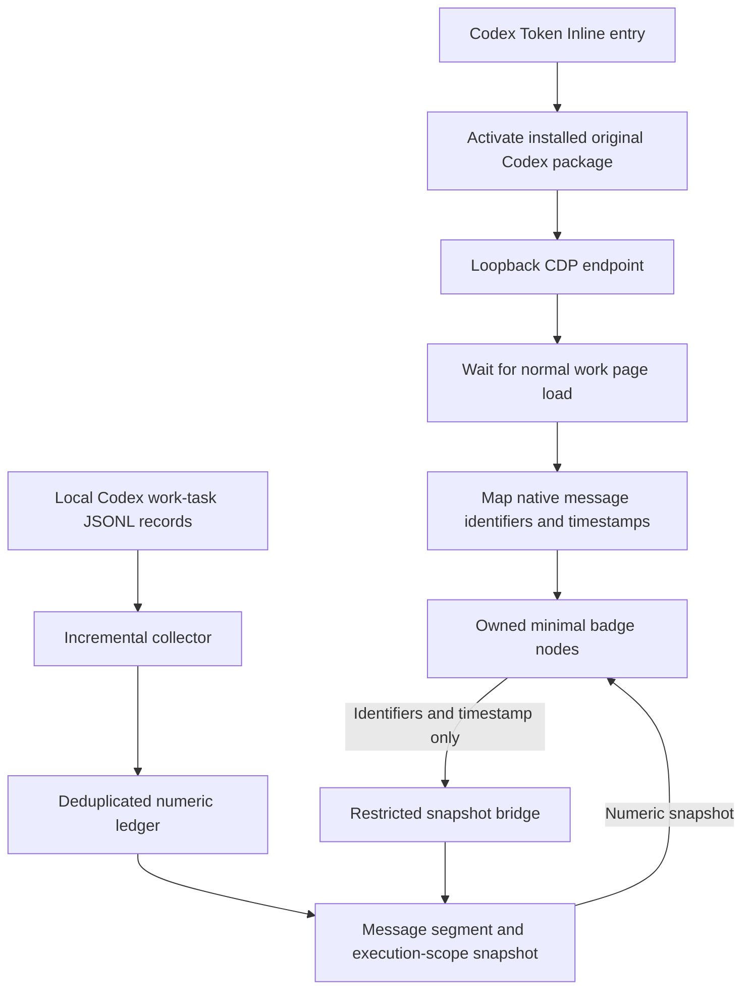

# How Codex Token Inline works

This document describes the current **0.2.0-alpha.4 passive DOM adapter**, not the earlier copied-client experiment. It applies only to **Codex work mode**. GPT regular chat is unsupported and is not a planned feature at present.

## User-visible accounting / 用户看到的统计逻辑

Within one execution scope, suppose successive message segments consume 100, 50, and 20 tokens:

| 消息段 / Segment | 本段新增 / Segment usage | 截至此段的总量 / Running total | 默认显示 / Resting label |
| --- | ---: | ---: | --- |
| 1 | 100 | 100 | `100 tokens` |
| 2 | 50 | 150 | `50 · 150 tokens` |
| 3 | 20 | 170 | `20 · 170 tokens` |

**左边本段，右边总量。第一段不重复显示相同的总量。** Older segments retain their recorded boundaries while the newest can grow. The final total is `100 + 50 + 20 = 170`, not `100 + 150 + 170`.

“本段”是按消息时间边界归属的一段模型调用用量，不是那条消息可见文本的 token 字数。它可包括生成消息期间关联的输入、工具往返和输出。A request submitted after the previous execution completed starts another default scope; its usage is not appended to the completed execution.

### Hover details / 鼠标悬停

The resting label stays compact. Hover or keyboard focus reveals exactly three rows, in this order:

```text
输入        40
输出        10
缓存命中    20 · 50%
```

This example belongs to the second segment above: `40 input + 10 output = 50 tokens`. Of those 40 input tokens, 20 were cache hits. Cache hits are already included in input, so the result is not 70. The cache-hit rate is `20 / 40 = 50%`.

**悬停明细对应左侧的本段新增量，不是右侧的整个范围总量。** Large resting values use two decimal places in millions; hover values retain integer precision.

### Pending records / 等待用量记录

A newly visible segment can precede its first usage record by many seconds. One local observation had an approximately 86-second gap. While the newest segment is active and its range has no records, show `— · 476,637 tokens` and pending hover rows. Keep the known running total. `segmentHasData` distinguishes this case from an actual recorded zero; completed or frozen segments retain their computed values. Do not estimate missing usage from elapsed time or text length.

### Completion and scope

- The default scope is one native execution/run. User steering while it is running stays in that scope.
- A recorded run completion turns its badges gray. An older segment may freeze before the scope completes; freezing and completion are different states.
- An explicit objective can join executions, and its explicit completion takes precedence. Automatic interpretation of a natural-language long-term goal is not implemented.
- Late-arriving usage may reconcile already-recorded boundaries. Frozen means later work is excluded, not that delayed evidence is knowingly discarded.
- Different tasks and child-agent tasks are not automatically aggregated.

## Launch and data flow



### 1. Original application activation

`installer/launch-native.ps1` locates the installed OpenAI.Codex Store package, reads its application identity, and verifies the supported source fingerprints. It calls Windows `IApplicationActivationManager.ActivateApplication` with loopback debugging arguments.

The launched executable remains in the original package. No client copy, second client profile, ASAR write, certificate installation, or shortcut replacement is part of this route. A normally running client must first exit, because these arguments apply at launch. Untouched original Start-menu pins or self-created shortcuts therefore do not activate the enhancement.

The installer bundles Node and project source so users do not need to install a developer runtime. It records installed files for uninstall and supplies a small management window with version, author, upstream link, and uninstall entry. There is no automatic update channel.

### 2. Runtime attachment without navigation

`bin/native-runtime.mjs` connects to a verified `127.0.0.1` debugging endpoint, selects app-scheme pages, and waits for normal page completion. It installs a numeric request binding and evaluates this project's DOM adapter. It does not call `Page.reload`, navigate the page, or use `Fetch` interception. An automated regression check guards this boundary.

The original file fingerprints are still used to restrict compatibility. `src/native-assets.mjs` builds the injected source from this project's formatter, styles, and DOM adapter. Its old resource-substitution helpers remain development code and are not called by the current runtime.

### 3. Native message mapping and owned UI

`src/dom-badges.mjs` locates the current React tree and the supported native `Oy` message component. This is a private implementation detail of the checked client version, not an official extension API. It copies only `conversationId`, `turnId`, `item.sentAtMs`, and the available opaque message identifier into snapshot requests. It does not serialize native props or transmit message contents.

Each message anchor receives an owned badge. The adapter appends it to a visible native action row, or to a small left-aligned row below the message if native actions are hidden. Native content, buttons, and React state remain under the application's control. Unknown/missing message metadata produces no guessed counter. Pure thinking-only placeholders are not mapped yet.

The display formatter and stylesheet are shared with `src/usage.mjs` and `src/badge.mjs`; the current production adapter creates DOM nodes directly and does not mount a second React runtime.

### 4. Incremental local collection and deduplication

`src/collector.mjs` discovers work-task records under local CODEX_HOME, defaulting to the user's .codex directory, including sessions and archived_sessions. It reads complete JSONL lines incrementally and retains file offsets. It does not read auth.json.

`src/ledger.mjs` keeps numeric usage and opaque identifiers/timestamps. Exact response-level usage records are deduplicated by response identity. Legacy token_count records provide a fallback where exact records are unavailable; overlapping evidence must not be charged twice.

`src/usage.mjs` normalizes the counters:

```text
total = input + output
cached <= input
reasoning <= output
cache-hit rate = cached / input
```

These are local usage counts, not account-wide billing, currency estimates, or subscription quota measurements.

### 5. Message boundaries and snapshots

`src/service.mjs` resolves a message by its identifier/time and assigns it to the recorded native run. A final toolbar with only a turn identifier resolves to that run's final message rather than falling back to the entire task.

For a segment beginning at time S and the next segment beginning at time N:

```text
segment usage = sum of eligible records from S through N - 1
running total = sum of eligible records from scope start through N - 1
```

The first segment starts at scope start to include work before its visible message. The newest segment has an open upper boundary until later message/lifecycle evidence supplies a cutoff. Run ownership filters prevent a subsequent independent request from increasing the preceding run's total. Explicit-objective cutoffs are applied when present.

The bridge returns segmentUsage, segmentHasData, usage, hasPriorSegments, frozen, and status. The DOM adapter formats the segment/total pair and displays segment-only hover details.

### 6. Refresh and cleanup

The DOM adapter checks on a roughly 500ms cadence while visible. Snapshot requests do not overlap per badge, and active requests wait at least 500ms after completion before another read; actual updates may take longer. Frozen snapshots are revisited around every 10 seconds; hidden-page checks have at least a 2-second interval. Identical formatted values do not trigger badge-content rewrites.

The helper polls app targets and exits after the original app closes. Temporary numeric diagnostics are limited to the enhancement's state directory. Normal uninstall requires the helper to exit, removes registered enhancement files/shortcuts/state, and leaves shared Codex records intact. The debugging endpoint belongs to Codex and closes when that Codex process exits.

## Evidence and limitations

- Local user confirmed visible original-window work-mode counters; installation and clean uninstall were verified on the development PC.
- Synthetic tests cover segment examples, boundaries, late evidence, subset accounting, completion colors, tooltip order, DOM preservation, origin confinement, and navigation isolation.
- This is not a multi-device compatibility certification. Private native component names can change between releases.
- Missing or unsynchronized logs cause incomplete coverage. The collector does not infer missing usage from text.
- A trailing incomplete JSONL line waits for completion. Mixed exact/legacy evidence can undercount where suppression is needed to avoid duplication. Growing in-place rewrites are not a fully handled rotation case.
- CDP has broader powers than the numeric bridge. The loopback/ownership restrictions matter; do not expose its endpoint remotely.

## Upstream reference

The original-package activation and CDP runtime-injection approach draws on [JiaYang-BUAA/Codex-Desktop-Usage-Monitor-Windows](https://github.com/JiaYang-BUAA/Codex-Desktop-Usage-Monitor-Windows). The launcher's COM code is adapted from its monitor-utils.ps1; our accounting and message DOM adapter are separately maintained. See [THIRD_PARTY_NOTICES.md](../THIRD_PARTY_NOTICES.md) for the precise reference and retained MIT license.
